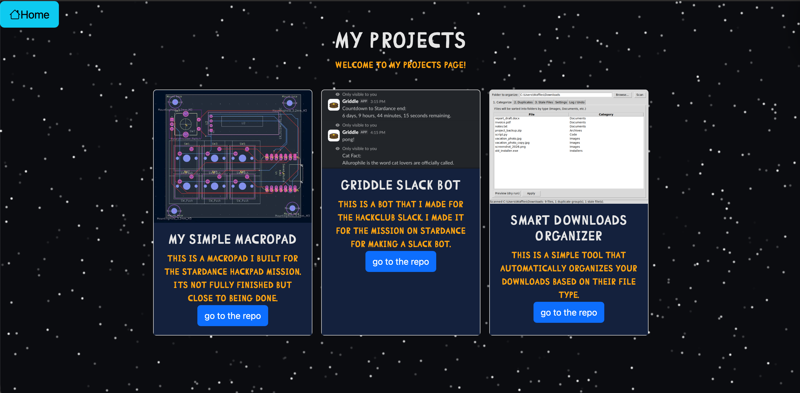
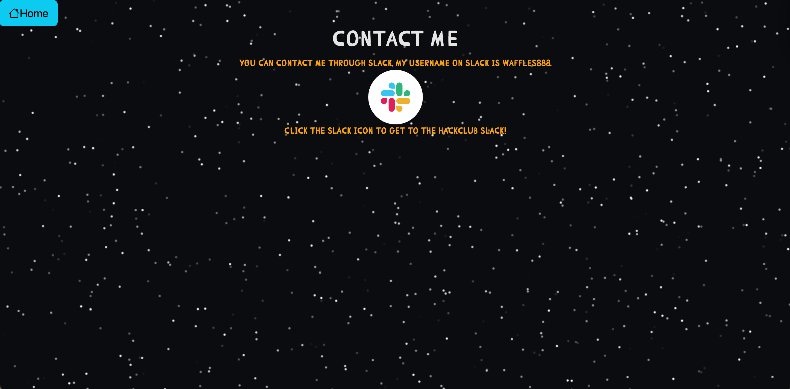

# pixl-personal-site
This is a page made for pixl as a personal site, this is something I made as a starter project for pixl.

# Features
This site hosts information about the projects I have worked on, ways to contact me and a way to access all of my repos. It also features a stary background which was created in javascript.

# Description
I created this site using bootstrap for certain things such as the cards, buttons and icons used across the site. Alot of the CSS was done by me allowing me to change the colours and overall theme the website in a way that I enjoyed and liked the look of. The main part of the site that i am really proud of is the background as it took me a fair number of hours of debugging and testing to ensure it all looked good and worked correctly.

# Gif of my site
This is a gif which shows of the background I had created

Below are two screenshots of the other pages seen on my site

# Getting started/running program
To access my site you simple go to <a href="https://waffles-888.github.io/pixl-personal-site">this URL.</a> From there you can see the three pages on my site.

## Dependencies
This was created using javascript, CSS and html, all hosted using pages on github. Due to this being a site nothing is needed other than a browser and an internet connection to view the site.

# Issues I overcame while making this project
I found that I would forget simple things which can be easily overlooked, things like image paths not being set correctly being literally a charater off or even just outright forgetting to reference the CSS file in the html entirely. Using javascript was something on another scale as I never used it before but it ended in a really nice site

## Help
If pages are not displaying correctly or loading at all then attempt to clear your browser cache and reload the site.
## License
MIT