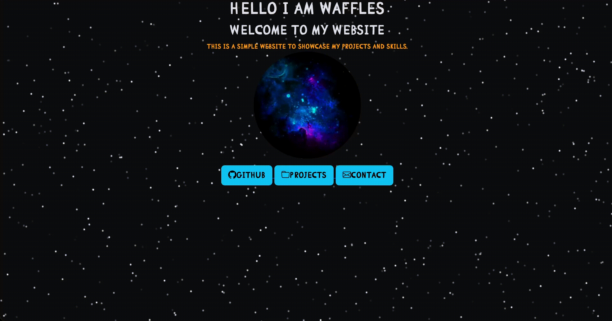

# pixl-personal-site
This is a page made for pixl as a personal site, this is something I made as a starter project for pixl.

# Description
This isnt a major project however it has taken me some time to learn certain things and different ways to make things, this project has still made me learn things even with other sites I have created. This site in particular is a site that shows my most up to date projects as well as follows a different theme to the other sites I have created for other things, as well as holding information about the proecjts I have worked on it also gives users who may want to contact me a way to as well as a way for users to access my github quickly.

# Screenshot of my site

# Issues i overcame while making this project
I found that I would forget simple things which can be easily overlooked, things like image paths not being set correctly being literally a charater off or even just outright forgetting to reference the CSS file in the html entirely.